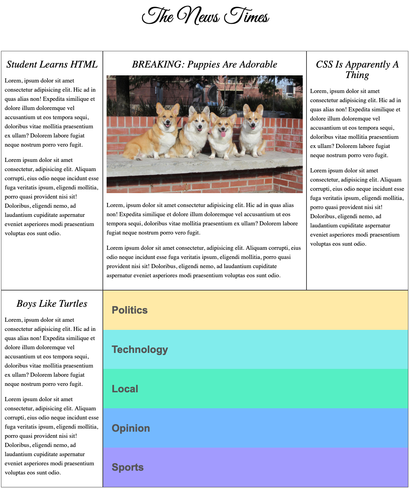

_Frontend Masters: Intro To Web Dev v2 course | jukka.kansanaho@gmail.com | 2020-10-02_

# Frontend Masters: Intro To Web Dev v2

This course can be found from Frontend Masters by Brian Holt.
Target of the course is to learn Web Development basics.

- Frontend Masters: Intro To Web Dev v2 course page: https://frontendmasters.com/courses/web-development-v2
- Resource material used in this course: https://btholt.github.io/intro-to-web-dev-v2
- This course in Github: https://github.com/btholt/intro-to-web-dev-v2

# Topics

- Web development (in general), HTML, CSS, JavaScript,AJAX, Node.js, Git

# Projects

#### HTML + CSS: The News Times web page

#### HTML + CSS + JS: online Calculator

